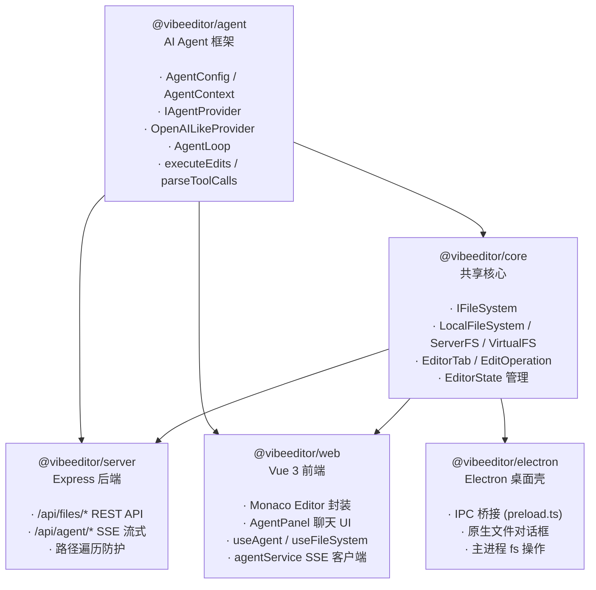
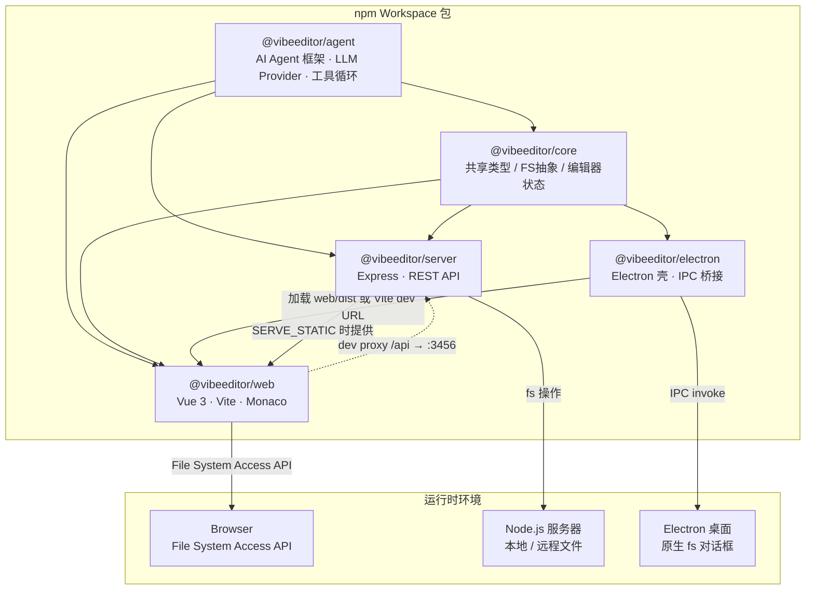
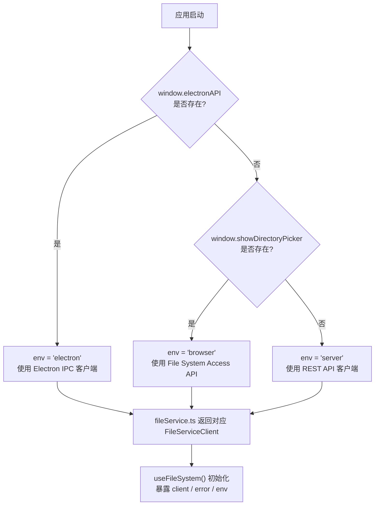
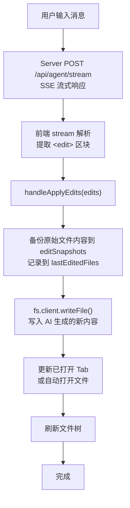
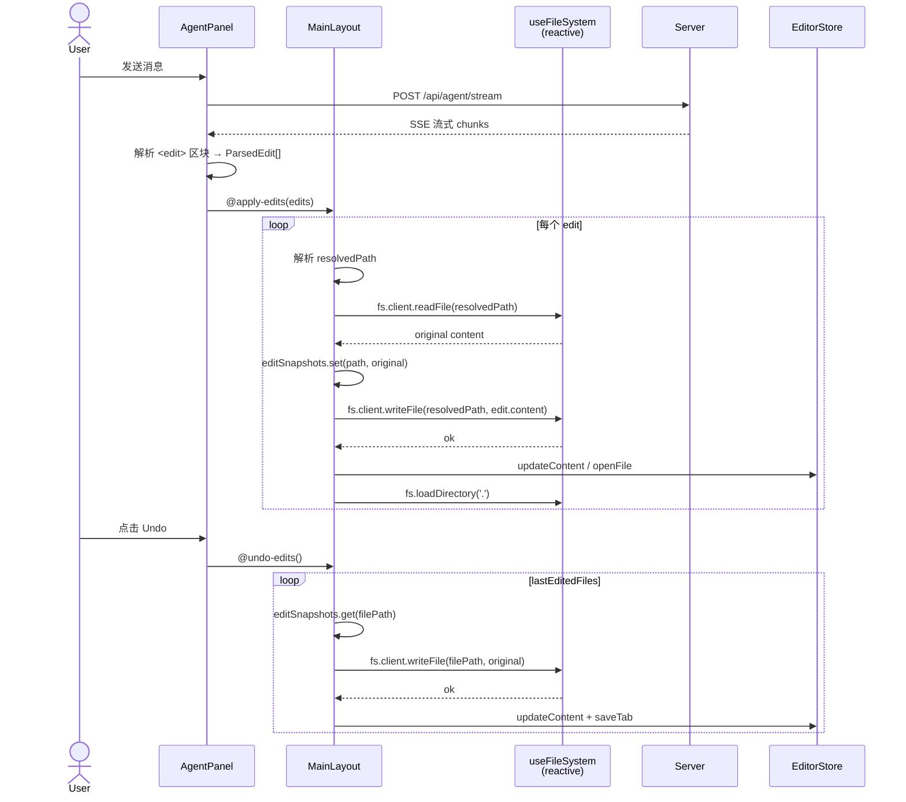

# VibeEditor

> [English](README_EN.md)

基于 **Monaco Editor** + **Vue 3** 的 AI 辅助代码编辑器，同时支持**服务器部署**和 **Electron 桌面端**。

## 功能需求与开发进度

> **图例**: ✅ 已完成 &nbsp; ⚠️ 框架就绪，待实现 &nbsp; ❌ 未开始

### P0 — 核心编辑

| # | 功能 | 状态 | 说明 |
|---|------|------|------|
| 1 | Monaco Editor 集成 | ✅ | 语法高亮、vs-dark 主题、Minimap、Bracket 配对 |
| 2 | 多 Tab 管理 / 脏标记 | ✅ | Pinia store 驱动, `packages/web/src/stores/editor.ts` |
| 3 | 打开文件 (本地/远程) | ✅ | Electron IPC + Server API 已通; 浏览器 File System Access API 仅框架 |
| 4 | 打开文件夹 (目录树) | ✅ | Electron `showOpenDialog` + Server `/api/files/list` 已通; 浏览器端未完成 |
| 5 | 文件保存 (Ctrl+S) | ✅ | Electron IPC + Server API 均已实现 |
| 6 | 新建无标题文件 | ✅ | `store.newUntitled()` |
| 7 | 键盘快捷键 | ⚠️ | 已绑定包含了复制（ctrl+c）、粘贴（ctrl+v）、剪切（ctrl+x）、撤销（ctrl+z）、恢复（ctrl+y）、查找（ctrl+f）、替换（ctrl+h）; Electron 菜单快捷键 IPC 桥接就绪但未接入; 缺少完整快捷键体系 |

### P1 — AI Agent 辅助编辑

| # | 功能 | 状态 | 说明 |
|---|------|------|------|
| 8 | Agent 对话面板 | ✅ | `AgentPanel.vue`, 支持 chat/edit/agent 三种模式、Markdown + KaTeX 渲染、多 Provider 配置管理 |
| 9 | Agent 消息流式输出 (SSE) | ✅ | Server SSE + 前端 stream 解析已完整打通; 支持真实 LLM 流式响应 |
| 10 | Agent 生成编辑操作并应用到文件 | ⚠️ | `<edit>` 区块解析 → 文件写入流程已打通; 但编辑/Agent 模式的 system prompt 在 `@vibeeditor/agent` 的 `provider.ts` 中被硬编码为 `chat` 模式 (Bug); `executor.ts` 未接入 |
| 11 | Agent 上下文构建 (打开文件+光标+选区) | ✅ | `@vibeeditor/agent` — `buildContextPrompt()` 已实现; 但前端 `useAgent.ts` 未填充 `openFiles`, `fileTree` 等上下文到请求中 |
| 12 | 编辑操作撤销/重做 | ⚠️ | `@vibeeditor/agent` — `revertEdits()` 已实现; 前端未接入 UI |
| 13 | LLM 后端对接 (OpenAI / Anthropic / etc.) | ⚠️ | 已通过 raw fetch 对接 OpenAI 兼容 API (支持 Ollama / vLLM 等); 无 SDK 依赖; 编辑/Agent 模式 system prompt 硬编码 bug (#10) 待修复 |

### P2 — 文件系统 & 项目管理

| # | 功能 | 状态 | 说明 |
|---|------|------|------|
| 14 | 三种文件系统实现 (`IFileSystem`) | ✅ | `LocalFileSystem` / `ServerFileSystem` / `VirtualFileSystem` |
| 15 | 运行时环境自动检测 | ✅ | `fileService.ts` → 检测 Electron / Server / Browser |
| 16 | 文件/文件夹重命名 | ✅ | 底层 API 已实现; 前端 UI 上下文菜单未做 |
| 17 | 文件/文件夹删除 | ✅ | 底层 API 已实现; 前端 UI 上下文菜单未做 |
| 18 | 新建文件/文件夹 | ✅️ | Server + Electron API 已实现; 新建文件/文件夹功能已集成至左上角File中 |
| 19 | 文件监听 / 自动刷新 | ⚠️ | `IFileSystem.watch()` 已定义, `LocalFileSystem` 实现了; Server 有 `chokidar` 依赖但未启用推送; 前端未消费 |
| 20 | 拖拽文件到编辑器打开 | ✅️ | |
| 21 | 最近打开的项目/文件列表 | ❌ | |
| 22 | 工作区持久化 (记住上次打开目录) | ❌ | Pinia store 纯内存, 刷新即丢失 (仅 LLM Provider 配置持久化到 localStorage) |

### P3 — 编辑增强

| # | 功能 | 状态 | 说明 |
|---|------|------|------|
| 23 | 搜索 / 替换 (单文件) | ✅️ | Monaco 内置 Find 控件可用 |
| 24 | 跨文件搜索 (项目级) | ❌ | |
| 25 | Diff 对比视图 | ❌ | Monaco 内置 diff editor, 未封装 |
| 26 | 代码折叠 / 大纲 | ✅ | 由 Monaco 原生支持 |
| 27 | 多光标编辑 | ✅ | 由 Monaco 原生支持 |
| 28 | 语法错误 / 诊断信息 | ❌ | 需接入 TypeScript/ESLint Language Server |
| 29 | 代码自动补全 / IntelliSense | ⚠️ | Monaco 内置基础补全; TypeScript 语言的智能补全未配置 |
| 30 | 代码片段 (Snippets) | ❌ | |
| 31 | 格式化 (Prettier 集成) | ❌ | Prettier 已安装为 devDependency 但未被调用 |
| 32 | 主题切换 (亮色/暗色/自定义) | ❌ | 仅硬编码 `vs-dark` |

### P4 — 部署 & 分发

| # | 功能 | 状态 | 说明 |
|---|------|------|------|
| 33 | 服务器部署 (Express + 静态前端) | ✅ | `SERVE_STATIC` 环境变量指向 `web/dist` |
| 34 | Electron 桌面应用 | ✅ | 支持 dev/prod 模式, IPC 文件操作, 文件对话框 |
| 35 | Electron 原生菜单栏 | ❌ | preload 暴露了 `onMenuAction` IPC 监听器, 但 main.ts 未创建任何菜单 |
| 36 | Electron 打包 / 安装程序 (electron-builder) | ⚠️ | `package.json` 已配置基本 `build` 字段 (appId, productName); 缺少平台目标 (win/mac/linux)、图标、自动更新等; 未验证 |
| 37 | 路径遍历防护 | ✅ | Server file routes 已做 `resolve` → `startsWith` 校验 |
| 38 | 认证 / 鉴权 (Bearer Token) | ⚠️ | 中间件已实现, 但 `index.ts` 中未被导入或挂载 (死代码) |
| 39 | Docker 部署 | ❌ | |
| 40 | CI/CD (GitHub Actions) | ❌ | |

### P5 — 体验 & 工程化

| # | 功能 | 状态 | 说明 |
|---|------|------|------|
| 41 | 自适应布局 (可拖拽分隔条) | ✅ | `MainLayout.vue` — 侧边栏宽度可调 |
| 42 | 状态栏 (光标位置、语言、编码) | ⚠️ | Monaco 编辑器内置状态栏已提供行/列/语言信息; 无自定义实现 |
| 43 | 右键上下文菜单 | ❌ | 文件树 / Tab 栏 / 编辑区均无 |
| 44 | 错误/通知提示 (Toast) | ❌ | `useFileSystem.error` 有定义但未被任何 UI 渲染 |
| 45 | 加载状态 / 骨架屏 | ⚠️ | 文件树及 Agent 面板已有文本型 "Loading..." 提示; 无骨架屏/动画 |
| 46 | 国际化 (i18n) | ❌ | |
| 47 | 响应式 / 移动端适配 | ❌ | 仅有 `<meta viewport>` 标签, 无 @media 查询 |
| 48 | 自动化测试 (unit / e2e) | ❌ | 无测试框架配置 |
| 49 | ESLint / Prettier 配置 | ❌ | 依赖已安装, 无配置文件 (lint 命令执行会失败) |
| 50 | 会话恢复 (重启后恢复 Tab) | ❌ | Pinia store 纯内存, 刷新即丢失 |

### 统计

| 状态 | 数量 |
|------|------|
| ✅ 已完成 | 19 |
| ⚠️ 框架就绪 | 11 |
| ❌ 未开始 | 20 |
| **合计** | **50** |

## 架构文档

### 1. 包依赖关系

> 箭头方向：`A --> B` 表示 B 依赖 A（A 是被依赖方）



**关键变化（相对旧架构）**：
- **新增** `@vibeeditor/agent` —— Agent 相关代码从 `core` 和 `server` 中抽离，形成独立的智能体模块
- **`@vibeeditor/core` 瘦身** —— 移除了 `agent/` 目录（types、context、executor），聚焦文件系统和编辑器状态
- **`@vibeeditor/server` 瘦身** —— 移除了 `agent/` 目录（provider、loop），改为依赖 `@vibeeditor/agent`
- **零外部依赖** —— `@vibeeditor/agent` 不依赖任何工作区包，通过 `IAgentFileSystem` 接口与平台解耦

### 2. 架构图 — 包依赖与部署拓扑



**说明**：`@vibeeditor/agent` 是独立的 AI Agent 框架模块，提供 LLM Provider、Agent 循环和工具执行等核心能力。`@vibeeditor/core` 聚焦文件系统抽象和编辑器状态管理。前端 `web` 在开发时通过 Vite proxy 将 `/api` 转发到 `server`；Electron 模式下前端由 Electron 窗口加载，文件操作通过 `preload.ts` 暴露的 IPC 桥接到主进程的 Node.js `fs`。

### 3. 流程图

#### 3.1 运行时环境检测与文件服务选择



**说明**：`detectEnvironment()` 在 `fileService.ts:22` 中一次性检测并缓存运行时环境，后续所有文件操作通过统一的 `FileServiceClient` 接口执行，上层组件不感知底层差异。

#### 3.2 Agent 编辑操作流程



**说明**：Agent 的每一次编辑操作在写入磁盘前都会自动备份原文件内容，使得用户可以通过 `undoLastEdits()` 一键回退所有修改。

### 4. 时序图 — Agent 编辑 & 撤销



**说明**：`handleApplyEdits` 在每次写入前先读取原文做快照；`undoLastEdits` 遍历 `lastEditedFiles` 逐一恢复。`fs` 由 `reactive(useFileSystem())` 创建，Vue 3 的 `reactive()` 自动解包嵌套 `ref`，因此访问时直接使用 `fs.client` 而非 `fs.client.value`。

### 5. 类图 — 核心类型体系

```mermaid
classDiagram
    class IFileSystem {
        <<interface>>
        +type: 'local'|'server'|'virtual'
        +cwd: string
        +readFile(path) Promise~string~
        +writeFile(path, content) Promise~void~
        +deleteFile(path) Promise~void~
        +readDir(path) Promise~FileEntry[]
        +createDir(path) Promise~void~
        +exists(path) Promise~boolean~
        +stat(path) Promise~FileEntry~
        +rename(oldPath, newPath) Promise~void~
        +dispose() void
    }

    class LocalFileSystem {
        +type: 'local'
        +实现: Node.js fs/promises
    }

    class ServerFileSystem {
        +type: 'server'
        +实现: REST fetch /api/files/*
    }

    class VirtualFileSystem {
        +type: 'virtual'
        +实现: 内存 Map
    }

    class FileServiceClient {
        <<interface>>
        +readFile/writeFile/deleteFile()
        +readDir/createDir/deleteDir()
        +exists/stat/rename()
        +openFolder/openFile/saveFileAs()
    }

    class IAgentProvider {
        <<interface>>
        +name: string
        +initialize(config) Promise~void~
        +sendMessage(msg, ctx) Promise~AgentMessage~
        +streamMessage(msg, ctx, onChunk) Promise~AgentMessage~
    }

    IFileSystem <|.. LocalFileSystem
    IFileSystem <|.. ServerFileSystem
    IFileSystem <|.. VirtualFileSystem
    FileServiceClient <|.. ElectronClient
    FileServiceClient <|.. ServerClient
    FileServiceClient <|.. BrowserClient

    class EditorTab {
        +id: string
        +name: string
        +path: string
        +content: string
        +language: string
        +isDirty: boolean
        +isUntitled: boolean
    }

    class EditorStore {
        +tabs: EditorTab[]
        +activeTabId: string
        +fileTreeNodes: FileEntry[]
        +workspaceRoot: string
        +workspaceMode: string
        +openFile(path, content)
        +closeTab(id)
        +updateContent(id, content)
        +saveTab(id)
    }

    class AgentContext {
        +openFiles: path[] | content[]
        +fileTree: string[]
        +cursorPosition
        +selection
        +conversationHistory: AgentMessage[]
    }

    class AgentMessage {
        +id: string
        +role: 'user'|'assistant'|'system'
        +content: string
        +timestamp: number
        +editOperations: AgentEditResult[]
    }
```



**说明**：`IFileSystem` 是底层文件系统抽象，3 种实现覆盖本地 / 远程 / 内存场景。`FileServiceClient` 是前端统一的服务接口，在 `fileService.ts` 中根据运行时环境选择 Electron IPC / REST / File System Access API 三种客户端。`EditorStore`（Pinia）是前端唯一状态源，管理 Tab、文件树和工作区元数据。

## 快速开始

```bash
# 安装依赖
npm install

# 同时启动服务器和前端（自动构建 @vibeeditor/core）
npm run dev:all

# 或分别启动（均会自动构建 @vibeeditor/core）
npm run dev:server   # 后端运行在 http://localhost:3456
npm run dev:web      # 前端运行在 http://localhost:5173
npm run dev:electron # Electron 桌面端（自动启动 Vite 前端 + Electron 窗口）
```

## 部署模式

| 模式 | 文件系统 | 启动命令 |
|------|---------|---------|
| **Electron** 桌面端 | 本地 FS, 通过 IPC (`Node.js fs`) | `npm run dev:electron`（自动启动 Vite + Electron，自动构建 core 和 electron） |
| **Server** 部署 (远程文件) | Server FS, 通过 REST API | `npm run dev:server` + `npm run dev:web` |
| **Browser** 本地文件 | File System Access API | `npm run dev:web` |

前端会在运行时自动检测环境, 在 `packages/web/src/services/fileService.ts` 中选择合适的文件服务。

## 构建

```bash
npm run build:agent     # 构建 AI Agent 框架
npm run build:core      # 构建共享核心
npm run build:server    # 构建 Express 后端
npm run build:web       # 构建 Vue 前端 (输出到 packages/web/dist/)
npm run build:electron  # 构建 Electron 主进程
npm run build:all       # 构建所有包 (agent → core → web → server → electron)
```

## 服务端 API

| 方法 | 端点 | 说明 |
|------|------|------|
| GET | `/api/files/list?path=` | 列出目录内容 |
| GET | `/api/files/read?path=` | 读取文件内容 |
| POST | `/api/files/write` | 写入文件 `{ path, content }` |
| DELETE | `/api/files/delete?path=` | 删除文件 |
| POST | `/api/files/mkdir` | 创建目录 `{ path }` |
| DELETE | `/api/files/rmdir?path=` | 删除目录 |
| GET | `/api/files/exists?path=` | 检查路径是否存在 |
| GET | `/api/files/stat?path=` | 获取文件/目录元数据 |
| POST | `/api/files/rename` | 重命名 `{ oldPath, newPath }` |
| POST | `/api/agent/chat` | 发送消息给 Agent |
| POST | `/api/agent/stream` | 流式返回 Agent 响应 (SSE) |
| GET | `/api/health` | 健康检查 |

## 项目结构

### `@vibeeditor/agent`
- `types.ts` — `AgentConfig`, `AgentContext`, `IAgentProvider`, `IAgentFileSystem`, `EditOperation` 等核心类型
- `context.ts` — 上下文构建工具（`createEmptyContext`, `buildContextPrompt`, `getConversationSummary`）
- `executor.ts` — 编辑执行引擎（`executeEdits`, `revertEdits`）
- `parser.ts` — LLM 回复解析（`parseToolCalls`, `parseEditsFromText`）
- `provider.ts` — `OpenAILikeProvider` —— OpenAI 兼容 LLM 客户端（原生 fetch，无 SDK 依赖）
- `loop.ts` — `AgentLoop` —— 多轮自主编码循环（支持 read_file / list_dir / search_code 工具）

### `@vibeeditor/core`
- `fs/types.ts` — `IFileSystem` 接口, `FileEntry`, `FileContent`
- `fs/local.ts` — `LocalFileSystem` (Node.js fs)
- `fs/server.ts` — `ServerFileSystem` (REST 客户端)
- `fs/virtual.ts` — `VirtualFileSystem` (内存文件系统)
- `editor/types.ts` — `EditorTab`, `EditOperation`, 语言检测
- `editor/document.ts` — Tab/文档状态管理

### `@vibeeditor/web`
- `components/editor/MonacoEditor.vue` — Monaco 编辑器封装
- `components/file-tree/FileTree.vue` — 文件树侧边栏
- `components/toolbar/Toolbar.vue` — 顶部工具栏
- `components/agent/AgentPanel.vue` — AI 对话面板
- `components/layout/MainLayout.vue` — 可拖拽分隔布局
- `composables/useFileSystem.ts` — 文件操作 + 键盘快捷键
- `composables/useEditor.ts` — Monaco 编辑器实例管理
- `composables/useAgent.ts` — Agent 对话状态
- `stores/editor.ts` — Pinia 编辑器/Tab 状态 Store
- `services/agentService.ts` — Agent REST/SSE 客户端
- `services/fileService.ts` — 运行时环境检测 + 文件服务选择

### `@vibeeditor/server`
- `routes/files.ts` — 文件 CRUD API, 含路径遍历防护
- `routes/agent.ts` — Agent 对话 + 流式端点

### `@vibeeditor/electron`
- `main.ts` — 窗口创建, dev/production 模式切换（通过 `app.isPackaged` 检测, 开发模式自动加载 `http://localhost:5173`, 生产模式加载 `web/dist/index.html`）
- `preload.ts` — Context Bridge 暴露 `window.electronAPI`
- `ipc/file-handler.ts` — 原生文件对话框和文件系统操作