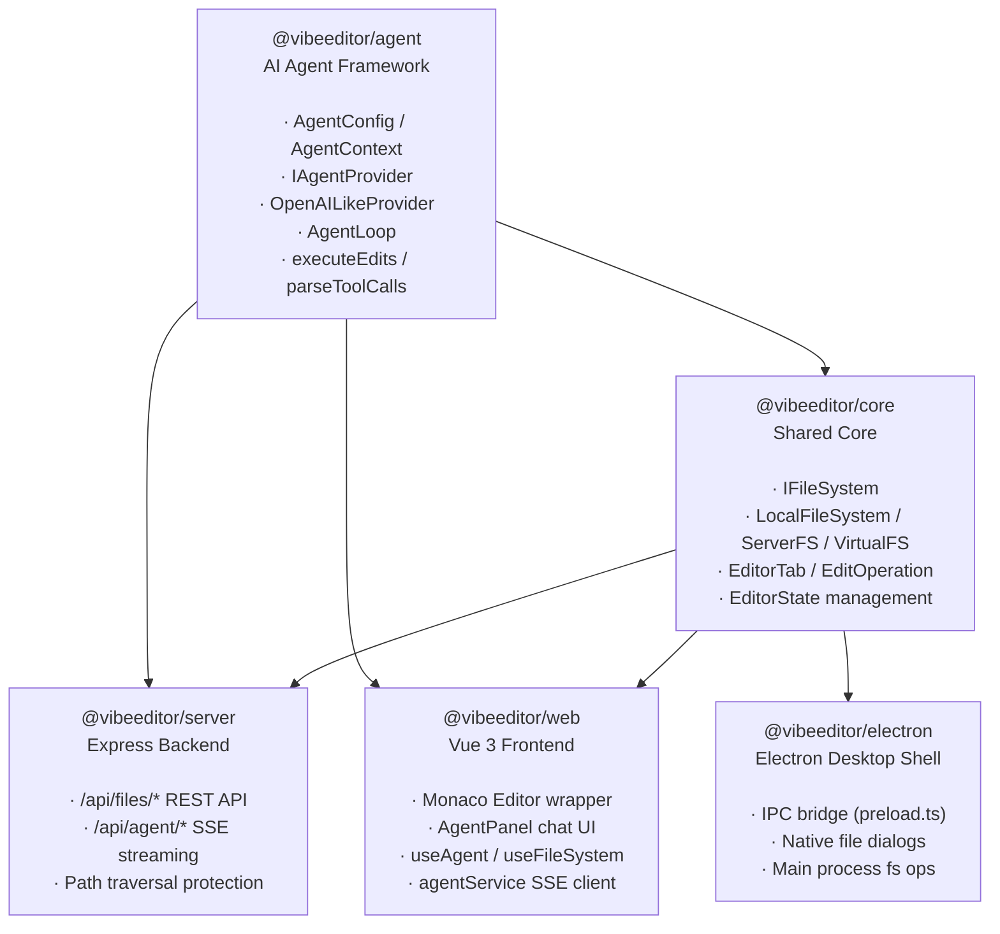
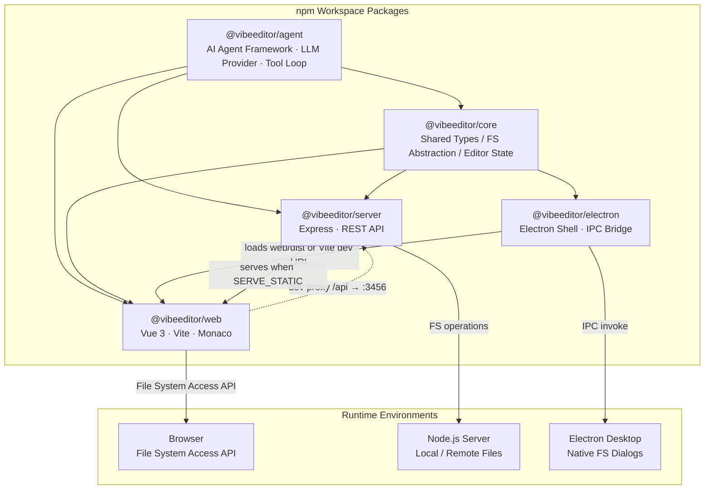
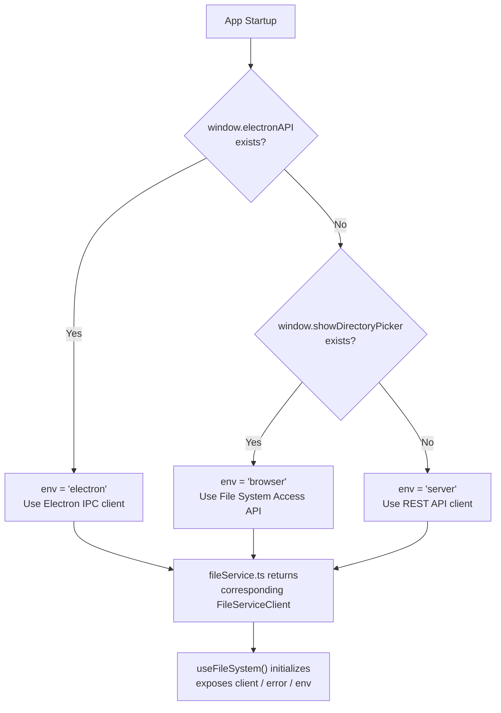
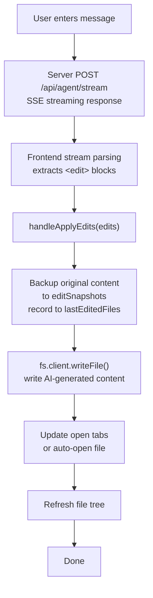
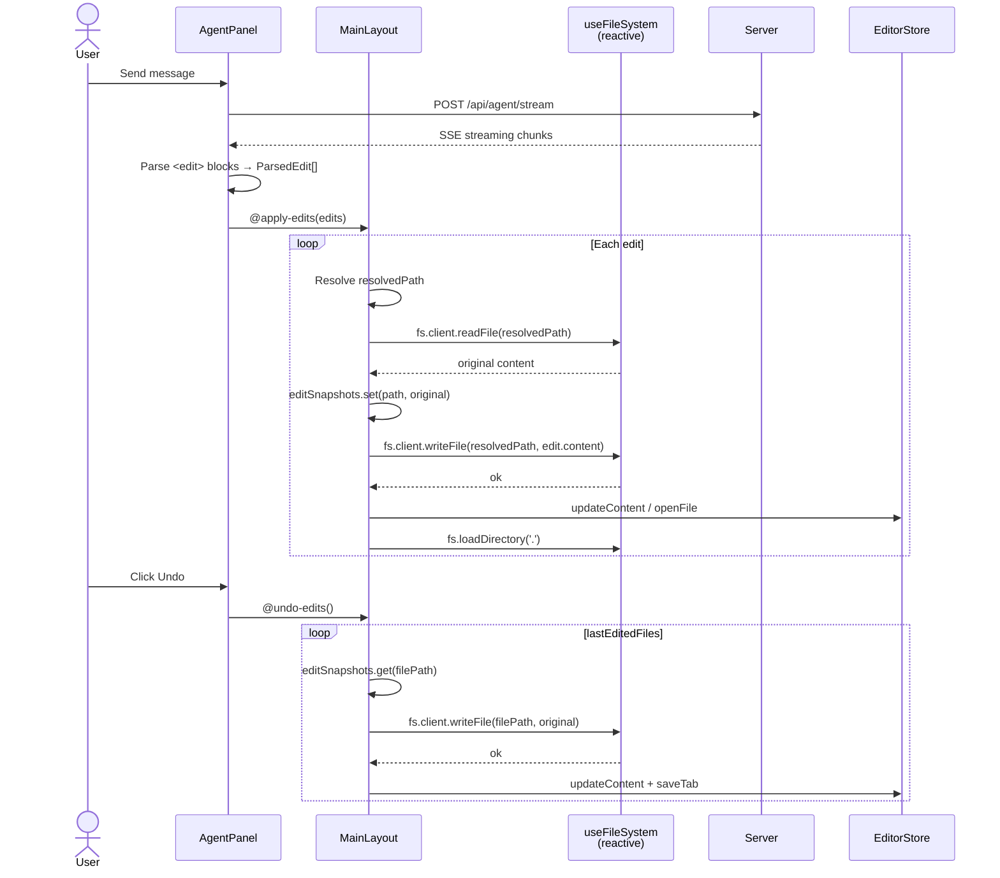

# VibeEditor

> [中文](README.md)

AI-powered code editor built with **Monaco Editor** + **Vue 3**, supporting both **server deployment** and **Electron desktop**.

## Features & Development Status

> **Legend**: ✅ Done &nbsp; ⚠️ Framework ready, needs implementation &nbsp; ❌ Not started

### P0 — Core Editing

| # | Feature | Status | Notes |
|---|---------|--------|-------|
| 1 | Monaco Editor integration | ✅ | Syntax highlighting, vs-dark theme, minimap, bracket pair colorization |
| 2 | Multi-tab management / dirty flag | ✅ | Pinia store driven, `packages/web/src/stores/editor.ts` |
| 3 | Open file (local / remote) | ✅ | Electron IPC + Server API working; browser File System Access API scaffold only |
| 4 | Open folder (file tree) | ✅ | Electron `showOpenDialog` + Server `/api/files/list` working; browser side incomplete |
| 5 | Save file (Ctrl+S) | ✅ | Electron IPC + Server API both implemented |
| 6 | New untitled file | ✅ | `store.newUntitled()` |
| 7 | Keyboard shortcuts | ⚠️ | Ctrl+S, Ctrl+C, Ctrl+V (custom copy/paste) bound; Electron menu shortcut IPC bridge ready but unused; full shortcut system missing |

### P1 — AI Agent Assisted Editing

| # | Feature | Status | Notes |
|---|---------|--------|-------|
| 8 | Agent chat panel | ✅ | `AgentPanel.vue`, supports chat/edit/agent modes, Markdown + KaTeX rendering, multi-provider config management |
| 9 | Agent streaming response (SSE) | ✅ | Server SSE + frontend stream parsing fully working with real LLM backend |
| 10 | Agent generates edits and applies to files | ⚠️ | `<edit>` tag parsing → file writing pipeline works end-to-end; but edit/agent mode system prompt hardcoded to `chat` in `@vibeeditor/agent` `provider.ts` (bug); `executor.ts` not wired |
| 11 | Agent context builder (open files + cursor + selection) | ✅ | `@vibeeditor/agent` — `buildContextPrompt()` implemented; frontend `useAgent.ts` does not populate `openFiles`/`fileTree` context in requests |
| 12 | Edit undo / redo | ⚠️ | `@vibeeditor/agent` — `revertEdits()` implemented; not wired to frontend UI |
| 13 | LLM backend integration (OpenAI / Anthropic / etc.) | ⚠️ | OpenAI-compatible API via raw fetch (works with Ollama, vLLM, etc.); no SDK dependencies; edit/agent mode system prompt bug (#10) needs fix |

### P2 — File System & Project Management

| # | Feature | Status | Notes |
|---|---------|--------|-------|
| 14 | Three file system implementations (`IFileSystem`) | ✅ | `LocalFileSystem` / `ServerFileSystem` / `VirtualFileSystem` |
| 15 | Runtime environment auto-detection | ✅ | `fileService.ts` → detect Electron / Server / Browser |
| 16 | File / folder rename | ✅ | Backend API implemented; frontend context menu UI not done |
| 17 | File / folder delete | ✅ | Backend API implemented; frontend context menu UI not done |
| 18 | New file / folder creation | ⚠️ | Server + Electron API implemented; frontend only has "+ New" button (creates untitled tab, prompts Save dialog on save) |
| 19 | File watching / auto-refresh | ⚠️ | `IFileSystem.watch()` defined, `LocalFileSystem` implemented; server has `chokidar` dependency but push not active; frontend not consuming |
| 20 | Drag and drop files to open | ❌ | |
| 21 | Recent projects / files list | ❌ | |
| 22 | Workspace persistence (remember last opened folder) | ❌ | Pinia store is in-memory only, lost on refresh (only LLM provider configs persist to localStorage) |

### P3 — Editing Enhancements

| # | Feature | Status | Notes |
|---|---------|--------|-------|
| 23 | Find / replace (single file) | ❌ | Monaco built-in Find widget available, but not custom-integrated |
| 24 | Cross-file search (project-wide) | ❌ | |
| 25 | Diff view | ❌ | Monaco built-in diff editor, not wrapped |
| 26 | Code folding / outline | ✅ | Supported natively by Monaco |
| 27 | Multi-cursor editing | ✅ | Supported natively by Monaco |
| 28 | Diagnostics / error highlighting | ❌ | Needs TypeScript/ESLint Language Server integration |
| 29 | Code completion / IntelliSense | ⚠️ | Monaco basic completion built-in; TypeScript smart completion not configured |
| 30 | Code snippets | ❌ | |
| 31 | Formatting (Prettier integration) | ❌ | Prettier installed as devDependency but never invoked |
| 32 | Theme switching (light / dark / custom) | ❌ | Only hardcoded `vs-dark` |

### P4 — Deployment & Distribution

| # | Feature | Status | Notes |
|---|---------|--------|-------|
| 33 | Server deployment (Express + static frontend) | ✅ | `SERVE_STATIC` env var points to `web/dist` |
| 34 | Electron desktop app | ✅ | Supports dev/prod mode, IPC file operations, file dialogs |
| 35 | Electron native menu bar | ❌ | Preload exposes `onMenuAction` IPC listener but `main.ts` never creates any menu |
| 36 | Electron packaging / installer (electron-builder) | ⚠️ | Basic `build` config in `package.json` (appId, productName); missing platform targets (win/mac/linux), icons, auto-update; not verified |
| 37 | Path traversal protection | ✅ | Server file routes enforce `resolve` → `startsWith` check |
| 38 | Authentication (Bearer Token) | ⚠️ | Middleware implemented but never imported or mounted in `index.ts` (dead code) |
| 39 | Docker deployment | ❌ | |
| 40 | CI/CD (GitHub Actions) | ❌ | |

### P5 — UX & Engineering

| # | Feature | Status | Notes |
|---|---------|--------|-------|
| 41 | Resizable layout (draggable splitter) | ✅ | `MainLayout.vue` — adjustable sidebar width |
| 42 | Status bar (cursor position, language, encoding) | ⚠️ | Monaco built-in status bar provides line/column/language; no custom implementation |
| 43 | Context menus (right-click) | ❌ | File tree / tab bar / editor area all missing |
| 44 | Error / notification toasts | ❌ | `useFileSystem.error` ref exists but never rendered by any UI |
| 45 | Loading states / skeletons | ⚠️ | Text-based "Loading..." indicators exist in FileTree and AgentPanel; no skeletons/animations |
| 46 | Internationalization (i18n) | ❌ | |
| 47 | Responsive / mobile adaptation | ❌ | Only `<meta viewport>` tag present; no @media queries |
| 48 | Automated testing (unit / e2e) | ❌ | No test framework configured |
| 49 | ESLint / Prettier config | ❌ | Dependencies installed, no config files (lint command will fail) |
| 50 | Session restore (reopen tabs on restart) | ❌ | Pinia store is in-memory only, lost on refresh |

### Summary

| Status | Count |
|--------|-------|
| ✅ Done | 19 |
| ⚠️ Scaffold ready | 11 |
| ❌ Not started | 20 |
| **Total** | **50** |

## Architecture Docs

### 1. Package Dependencies

> Arrow direction: `A --> B` means B depends on A



**Key changes (vs. old architecture)**:
- **New** `@vibeeditor/agent` — Agent code extracted from `core` and `server` into a standalone agent module
- **`@vibeeditor/core` slimmed** — Removed `agent/` directory (types, context, executor), now focuses on file system and editor state
- **`@vibeeditor/server` slimmed** — Removed `agent/` directory (provider, loop), now depends on `@vibeeditor/agent`
- **Zero external dependencies** — `@vibeeditor/agent` depends on no workspace packages, decoupled from platform via `IAgentFileSystem`

### 2. Architecture Diagram — Package Dependencies & Deployment Topology



**Note**: `@vibeeditor/agent` is a standalone AI Agent framework providing LLM Provider, Agent Loop, and tool execution. `@vibeeditor/core` focuses on file system abstraction and editor state management. The `web` frontend proxies `/api` to `server` via Vite in development. In Electron mode, the frontend is loaded by the Electron window, and file operations are bridged to the main process Node.js `fs` through `preload.ts` IPC.

### 3. Flowcharts

#### 3.1 Runtime Environment Detection & File Service Selection



**Note**: `detectEnvironment()` in `fileService.ts:22` detects and caches the runtime environment once. All subsequent file operations go through the unified `FileServiceClient` interface; upper-layer components are unaware of the underlying differences.

#### 3.2 Agent Edit Operation Flow



**Note**: Every agent edit operation automatically backs up the original file content before writing, enabling the user to roll back all changes with a single `undoLastEdits()` call.

### 4. Sequence Diagram — Agent Edit & Undo



**Note**: `handleApplyEdits` snapshots the original content before each write; `undoLastEdits` iterates `lastEditedFiles` to restore each file. `fs` is created via `reactive(useFileSystem())` — Vue 3's `reactive()` auto-unwraps nested `ref`s, so access uses `fs.client` directly, not `fs.client.value`.

### 5. Class Diagram — Core Type Hierarchy

```mermaid
classDiagram
    class IFileSystem {
        <<interface>>
        +type: 'local'|'server'|'virtual'
        +cwd: string
        +readFile(path) Promise~string~
        +writeFile(path, content) Promise~void~
        +deleteFile(path) Promise~void~
        +readDir(path) Promise~FileEntry[]
        +createDir(path) Promise~void~
        +exists(path) Promise~boolean~
        +stat(path) Promise~FileEntry~
        +rename(oldPath, newPath) Promise~void~
        +dispose() void
    }

    class LocalFileSystem {
        +type: 'local'
        +实现: Node.js fs/promises
    }

    class ServerFileSystem {
        +type: 'server'
        +实现: REST fetch /api/files/*
    }

    class VirtualFileSystem {
        +type: 'virtual'
        +实现: 内存 Map
    }

    class FileServiceClient {
        <<interface>>
        +readFile/writeFile/deleteFile()
        +readDir/createDir/deleteDir()
        +exists/stat/rename()
        +openFolder/openFile/saveFileAs()
    }

    class IAgentProvider {
        <<interface>>
        +name: string
        +initialize(config) Promise~void~
        +sendMessage(msg, ctx) Promise~AgentMessage~
        +streamMessage(msg, ctx, onChunk) Promise~AgentMessage~
    }

    IFileSystem <|.. LocalFileSystem
    IFileSystem <|.. ServerFileSystem
    IFileSystem <|.. VirtualFileSystem
    FileServiceClient <|.. ElectronClient
    FileServiceClient <|.. ServerClient
    FileServiceClient <|.. BrowserClient

    class EditorTab {
        +id: string
        +name: string
        +path: string
        +content: string
        +language: string
        +isDirty: boolean
        +isUntitled: boolean
    }

    class EditorStore {
        +tabs: EditorTab[]
        +activeTabId: string
        +fileTreeNodes: FileEntry[]
        +workspaceRoot: string
        +workspaceMode: string
        +openFile(path, content)
        +closeTab(id)
        +updateContent(id, content)
        +saveTab(id)
    }

    class AgentContext {
        +openFiles: path[] | content[]
        +fileTree: string[]
        +cursorPosition
        +selection
        +conversationHistory: AgentMessage[]
    }

    class AgentMessage {
        +id: string
        +role: 'user'|'assistant'|'system'
        +content: string
        +timestamp: number
        +editOperations: AgentEditResult[]
    }
```



**Note**: `IFileSystem` is the low-level file system abstraction, with 3 implementations covering local / remote / in-memory scenarios. `FileServiceClient` is the frontend's unified service interface; `fileService.ts` selects Electron IPC / REST / File System Access API clients based on the runtime environment. `EditorStore` (Pinia) is the single source of truth for the frontend, managing tabs, the file tree, and workspace metadata.

## Quick Start

```bash
# Install dependencies
npm install

# Start server + web frontend simultaneously (auto-builds @vibeeditor/core)
npm run dev:all

# Or start individually (each auto-builds @vibeeditor/core)
npm run dev:server   # Backend on http://localhost:3456
npm run dev:web      # Frontend on http://localhost:5173
npm run dev:electron # Electron desktop (auto-starts Vite frontend + Electron window)
```

## Deployment Modes

| Mode | File System | Command |
|------|------------|---------|
| **Electron** desktop | Local FS via IPC (`Node.js fs`) | `npm run dev:electron` (auto-starts Vite + Electron, auto-builds core & electron) |
| **Server** (remote files) | Server FS via REST API | `npm run dev:server` + `npm run dev:web` |
| **Browser** (local files) | File System Access API | `npm run dev:web` |

The frontend auto-detects the runtime environment and selects the appropriate file service at `packages/web/src/services/fileService.ts`.

## Build

```bash
npm run build:agent     # Build AI Agent framework
npm run build:core      # Build shared core
npm run build:server    # Build Express backend
npm run build:web       # Build Vue frontend (to packages/web/dist/)
npm run build:electron  # Build Electron main process
npm run build:all       # Build everything
```

## Server API

| Method | Endpoint | Description |
|--------|----------|-------------|
| GET | `/api/files/list?path=` | List directory contents |
| GET | `/api/files/read?path=` | Read file content |
| POST | `/api/files/write` | Write file `{ path, content }` |
| DELETE | `/api/files/delete?path=` | Delete file |
| POST | `/api/files/mkdir` | Create directory `{ path }` |
| DELETE | `/api/files/rmdir?path=` | Remove directory |
| GET | `/api/files/exists?path=` | Check path exists |
| GET | `/api/files/stat?path=` | Get file/dir metadata |
| POST | `/api/files/rename` | Rename `{ oldPath, newPath }` |
| POST | `/api/agent/chat` | Send message to agent |
| POST | `/api/agent/stream` | Stream agent response (SSE) |
| GET | `/api/health` | Health check |

## Project Structure

### `@vibeeditor/agent`
- `types.ts` — Core types: `AgentConfig`, `AgentContext`, `IAgentProvider`, `IAgentFileSystem`, `EditOperation`
- `context.ts` — Context builders (`createEmptyContext`, `buildContextPrompt`, `getConversationSummary`)
- `executor.ts` — Edit execution engine (`executeEdits`, `revertEdits`)
- `parser.ts` — LLM response parsing (`parseToolCalls`, `parseEditsFromText`)
- `provider.ts` — `OpenAILikeProvider` — OpenAI-compatible LLM client (native fetch, no SDK)
- `loop.ts` — `AgentLoop` — Multi-turn autonomous coding loop (read_file / list_dir / search_code tools)

### `@vibeeditor/core`
- `fs/types.ts` — `IFileSystem` interface, `FileEntry`, `FileContent`
- `fs/local.ts` — `LocalFileSystem` (Node.js fs)
- `fs/server.ts` — `ServerFileSystem` (REST client)
- `fs/virtual.ts` — `VirtualFileSystem` (in-memory)
- `editor/types.ts` — `EditorTab`, `EditOperation`, language detection
- `editor/document.ts` — Tab/document state management

### `@vibeeditor/web`
- `components/editor/MonacoEditor.vue` — Monaco editor wrapper
- `components/file-tree/FileTree.vue` — File tree sidebar
- `components/toolbar/Toolbar.vue` — Top toolbar
- `components/agent/AgentPanel.vue` — AI chat panel
- `components/layout/MainLayout.vue` — Resizable layout
- `composables/useFileSystem.ts` — File operations + keyboard shortcuts
- `composables/useEditor.ts` — Monaco editor instance management
- `composables/useAgent.ts` — Agent chat state
- `stores/editor.ts` — Pinia store for editor/tabs state
- `services/agentService.ts` — Agent REST/SSE client
- `services/fileService.ts` — Runtime detection + file service selection

### `@vibeeditor/server`
- `routes/files.ts` — File CRUD API with path traversal protection
- `routes/agent.ts` — Agent chat + streaming endpoints

### `@vibeeditor/electron`
- `main.ts` — Window creation, dev/production mode switching (uses `app.isPackaged` to detect: dev mode loads `http://localhost:5173`, production mode loads `web/dist/index.html`)
- `preload.ts` — Context bridge exposing `window.electronAPI`
- `ipc/file-handler.ts` — Native file dialogs and FS operations